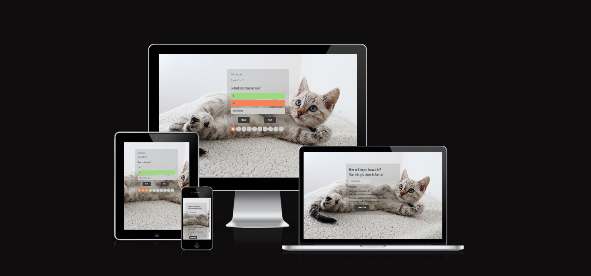

# Quiz App

This website is about a quiz game for cat lovers, but anyone can enjoy it. It has 10 questions and the question are shuffled to make it more challenging. A player must enter his/her username before playing, you cannot play without creating a username. When ever an answer is selected, there are both colors and images indicators to show whether the answer is correct or not. Players will not be able to go to the previous question and if you skip a question without answering it, it'll be counted as a wrong answer.

# Existing Features

## Home box

The home box is the first thing you see when you open the site. It contain the start button, instructions and an input box for user to enter their username. Once you enter your username you can click on the start quiz button.

## Game box

This is the box that will appear after you click the start button. It contains the question, options, the question number your on and two buttons for back and next. The next button takes you to the next question and the back button takes you the the home box. There are also indicator boxes on the buttom that indicates whether you get the answer right or wrong.

When the answer is correct:

When the answer is incorrect:

## The Result Box

This where the players result are dislplay. It also contains a button that takes you back to the home box.

 ## Technologies used

### HTML5
* As a structure language.

### CSS
* As a style language

### Javascript
* As a program language
* For the creation of dynamic and interactive website.

### Google fonts
* As a font resource.

### GitHub
* As a software hosting platform to keep project in a remote location.

### Git
* As a version-control system tracking.

### Gitpod
* As a development hosting platform

 ## Testing

 ## Performance testing

I run [Lighthouse](https://developers.google.com/web/tools/lighthouse/) tool to check performance of the website.

I noticed that this tests scores vary from time to time.

 ### Code Validation
 At the and of the project I used two websites to validate a code
 
 * [W3C CSS Validator](https://jigsaw.w3.org/css-validator/) to validate CSS.

 * [W3C Markup Validator](https://validator.w3.org/) to validate HTML.

### Responsive Testing

* Site was tested across multiple screen sizes.

 ## Deployment

This section should describe the process you went through to deploy the project to a hosting platform (e.g. GitHub) 

- The site was deployed to GitHub pages. The steps to deploy are as follows: 
  - In the GitHub repository, navigate to the Settings tab 
  - From the source section drop-down menu, select the Master Branch
  - Once the master branch has been selected, the page will be automatically refreshed with a detailed ribbon display to indicate the successful deployment. 

The live link can be found here - https://sireh-sanyang.github.io/Quiz-App/

## Credits

* Dribble [Dribble](http://dribbble.com/)

* Javascript Projects [JsProjects](https://codingartistweb.com/category/js/javascript-projects/)

* W3Schools: [W3Schools](https://www.w3schools.com/tags/tag_input.asp)

* To complete this project I used Code Institute student template: [gitpod full template](https://github.com/Code-Institute-Org/gitpod-full-template)

* All the images used in the website are from unsplash.